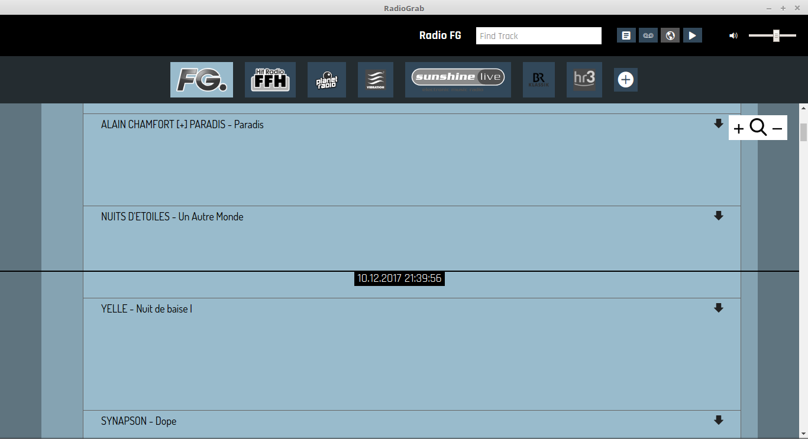
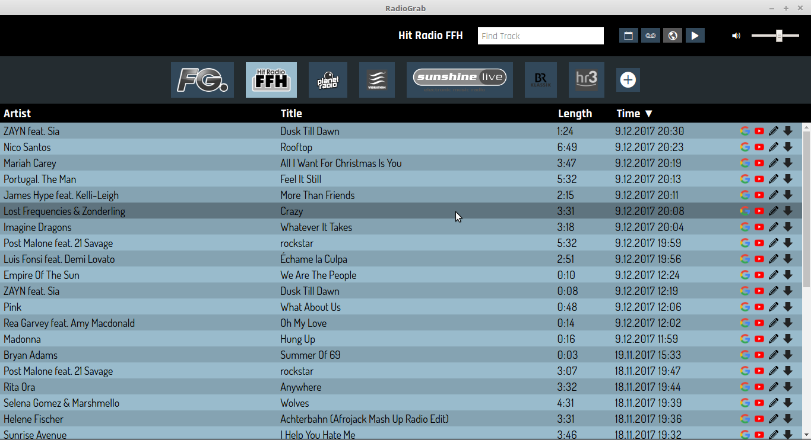
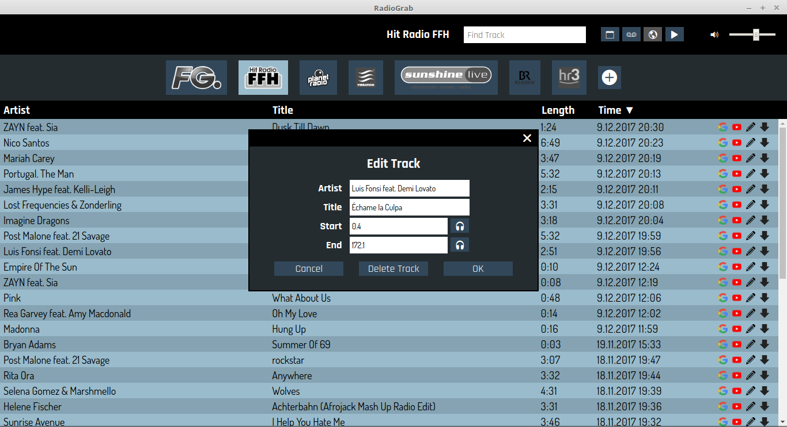
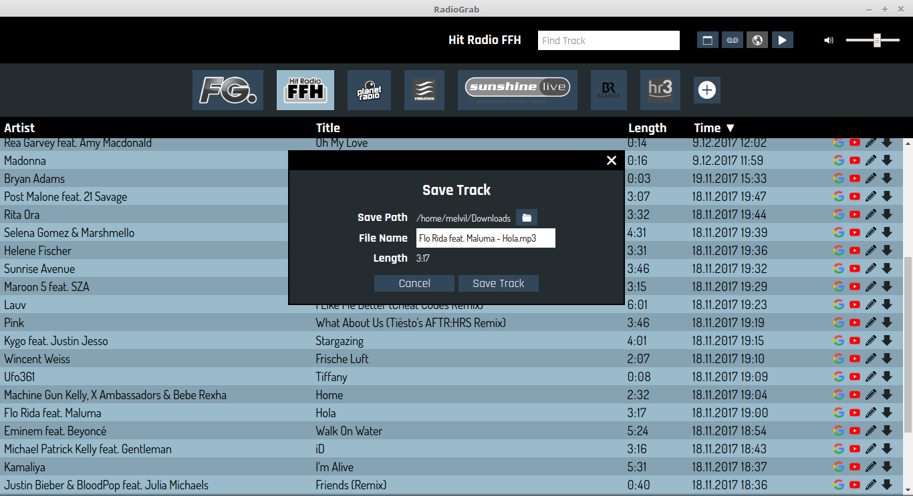

# RadioGrab

RadioGrab is a desktop app to record radio stations. It shows a list of the collected tracks in a table. The tracks can be played individually and also be saved as MP3 file.

## Screenshots

## Motivation

I started this project because I wanted to have an open-source alternative for Radio.fx/ClipInc, and there was none. At the same time, this is my playground to discover the electron framework (that allows to develop desktop apps using web technologies).

## Technologies

* Desktop app framework: [electron](https://electron.atom.io/)
* Frontend: [vue](https://vuejs.org/)
* Track extraction: [FFmpeg](https://www.ffmpeg.org/download.html)

## Installation

TODO

## Configuration Files

TODO

## Development Setup

1. Clone this repo.
2. Run `yarn install`.
3. Make sure that [FFmpeg](https://www.ffmpeg.org/download.html) is installed on your computer and in your PATH.
4. `npm start` starts the app in development mode.
5. `npm build` builds executables for all platforms supported by electron. See the package.json file for other build commands.